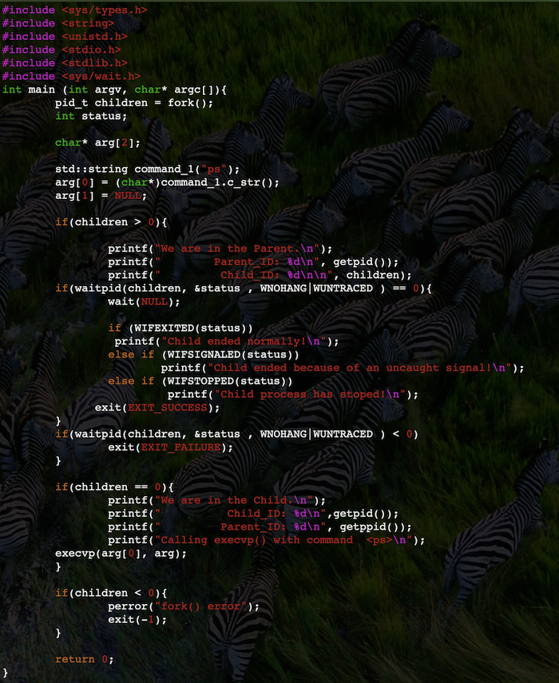
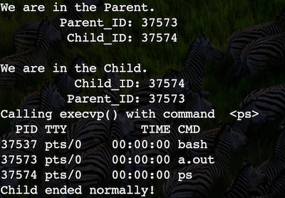

# CS 100 Programming Project
**Winter 2019**

William Montes SID: 862095355

Wesley DeVore	 SID: 862081656

# INTRODUCTION

This program is a command shell that will be able to take in commands from user input and execute them in the correct order while handling errors given by incorrect commands. This program will use a composite of connector and command objects stored in a tree to achieve this functionality. We will be using a parsing function to split up the user input into its commands, complete with any arguments for it being placed into a string and passed into the command constructor, and connectors which include and, or, semi-colon, input redirection, output redirection, and pipe. These objects will be used to create a tree while parsing, and the tree will execute the commands by traversing through itself with each connector evaluating based on a truth value that tells it whether to operate on its children or not.

# UML DIAGRAM

# CLASS DESCRIPTION

**composite**

The group of classes that we are using will be part of a base that has the **compute()** function. This function be what is run throughout the tree to get the proper functionality.

The group goes into one of two classes, the *command* class and the *separator* class.

The *command* class is the class that holds the type of command being executed such as echo and ls and its **compute()** will excecute that command when called. This class will be constructed with a string and a vector of strings. The string will hold the type of command, like echo and ls, whereas the vector will hold the arguments that come with that command if any.

The *separator* class contains a left and right base child, and can be split into three subclasses of *and*, *or*, and *semiColon*. These classes inherit the **compute()** function from *separator*, but all three execute it in a different way. 

The *and* class will run **compute()** on its left child and only run right child if the left child **compute()** returns a positive. 

The *or* class will run **compute()** on its left child and only run right child if the left child **compute()** returns a negative. 

The *semiColon* class will always run its left child **compute()** and then its right child **compute()** if it has a right child.

The *left* class will act as input redirection and run the left child **compute()** using the right childs file as input.

The *right* class will act as output redirection and run the left child **compute()** using the right childs file as output, either creating a new file or rewriting an existing file.

The *redirection* class will also act as output redirection and run the left child **compute()** using the right childs file as output, either appending to a file or creating a new one.

The *pipe* class will link the left child with the right child by sending the output of the left child **compute()** as the input to the right childs **compute()**

# PROTOTYPE/RESEARCH
The fork(), waitpid(), execvp(), and stat() are system calls that provide services of the operating system to the user. 

The system call fork() is used to create necessary processes. This system call takes no arguments and will return a process ID and its
purpose is to create a new process that in turn will become the child process of the caller/parent. After the creation of this child process both the parent and child processes will execute on the next instruction. This is why it is important to distinguish between the parent process and the child process, which is usually done testing the return value of fork(). Thus, when fork() returns a value < 0, the creation of a subprocess/child process was unsuccessful. If fork() returns a value > 0,  then this is the parent process. Lastly, if fork() returns 0, then the creation of the child process was successful. 

The system call execvp()  is part of the exec() family of functions that replace the current process image with a different image. Specifically, the function execvp() allows the caller to specify through an array of pointers with null terminating elements a list of commands available to the new program. For example, for the .cpp bellow execvp() is used with the command ps, which outputs to the console the information about any currently running processes. 

The system call waitpid() will suspend the calling process until the process specified by its first argument has terminated. When this process terminates the status of the termination will be stored in its second argument, specified through a pointer. After the execution of the waitpid() the calling process will resume execution. 

The main.cpp file above, starts by creating a child process and storing its value in pid_t children. It then creates char* arg[2] ={"ps",NULL}, which is later used in execvp(arg[0],arg). It then checks for the value of children, as it outputs to the console the processing ID of both the child and parent. Lastly, it calls waitpid(children, &status, WNOHANG|WUNTRACED ), which when in child-process will execute wait(NULL) followed by an output that will let the user know the ending status of the child process. The output of this code is presented below.

Lastly, the function call stat() is used to acquire information about a file/path. this function will struct various information about the file. This stat structure contains the following fields. 

                dev_t     st_dev;     /* ID of device containing file */
                ino_t     st_ino;     /* inode number */
                mode_t    st_mode;    /* protection */
                nlink_t   st_nlink;   /* number of hard links */
                uid_t     st_uid;     /* user ID of owner */
                gid_t     st_gid;     /* group ID of owner */
                dev_t     st_rdev;    /* device ID (if special file) */
                off_t     st_size;    /* total size, in bytes */
                blksize_t st_blksize; /* blocksize for file system I/O */
                blkcnt_t  st_blocks;  /* number of 512B blocks allocated */
                time_t    st_atime;   /* time of last access */
                time_t    st_mtime;   /* time of last modification */
                time_t    st_ctime;   /* time of last status change */ 

Addtionally, it is posible to check the file type using stat_variable.st_mode with the following macros.\
S_ISREG(stat_variable.st_mode)  To check for a regular file.\
S_ISDIR(stat_variable.st_mode)  To check if the path is a DIRECTORY.\
S_ISFIFO(stat_variable.st_mode) To check FIFO(name pipe).\
S_ISCHR(stat_variable.st_mode)  To check for character device.\
S_ISBLK(stat_variable.st_mode)  To check for block device.\
S_ISLNK(stat_variable.st_mode)  To check for symbolic link.\
S_ISSOCK(stat_variable.st_mode) To check for socket.\

# ROADMAP & ISSUES

- [ ] [Create the base class](https://github.com/cs100/assignment-cs-100-wes-will/issues/4#issue-406038685)

- [ ] [Create the parsing function](https://github.com/cs100/assignment-cs-100-wes-will/issues/2#issue-406038594)

- [ ] [Create the command class and its compute() function](https://github.com/cs100/assignment-cs-100-wes-will/issues/6#issue-406038747)

- [ ] [Test the command class compute() function](https://github.com/cs100/assignment-cs-100-wes-will/issues/7#issue-406038798)

- [ ] [Create the connector class](https://github.com/cs100/assignment-cs-100-wes-will/issues/5#issue-406038698)

- [ ] [Create the and class](https://github.com/cs100/assignment-cs-100-wes-will/issues/8#issue-406038829)

- [ ] [Create the or class](https://github.com/cs100/assignment-cs-100-wes-will/issues/9#issue-406038852)

- [ ] [Create the semiColon class](https://github.com/cs100/assignment-cs-100-wes-will/issues/10#issue-406038892)

- [ ] [Test the and or and semiColon class for correct ordering](https://github.com/cs100/assignment-cs-100-wes-will/issues/11#issue-406038956)

- [ ] [Create the tree that will execute base objects](https://github.com/cs100/assignment-cs-100-wes-will/issues/12#issue-406039017)

- [ ] Create the parentheses decorator class

- [ ] Create the test command class

- [ ] Test command and parentheses

- [ ] Add test and parentheses into parsing function

- [ ] Test for proper parsing functionality

- [ ] Create left connector class

- [ ] Create right connector class

- [ ] Create redirection connector class

- [ ] Create pipe connector class

- [ ] Add left, right, redirection, and pipe into the parsing function

- [ ] Test proper parsing of new classes

- [ ] Test input and output redirection

- [ ] Test piping

